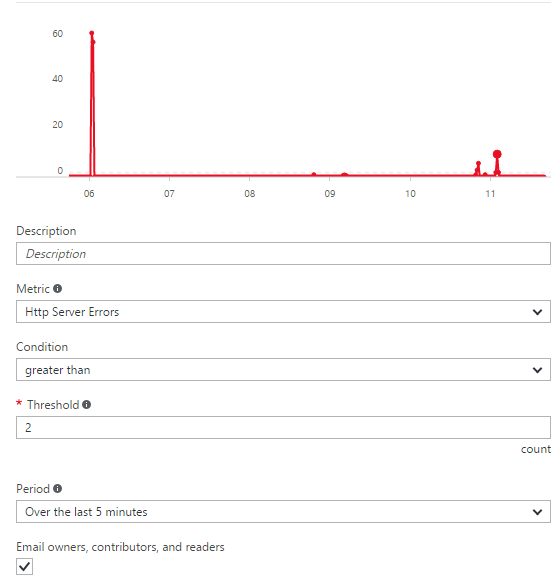
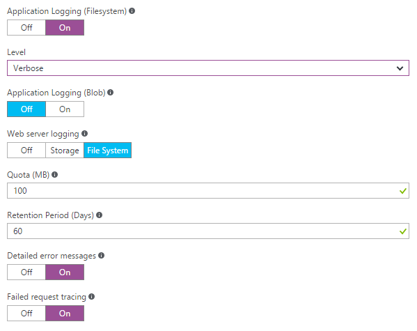

Since I moving my blog into Azure (as detailed in a [previous post](/migrating-running-wordpress-in-azure/)), I had started to see a series of odd alerts being fired out, with lots of random 500 errors at odd times of the day & night. When I checked the website was fine. At first thought this was related to the Azure App Service I was hosting my site in, but it occurred to me that it could have been happening before, but I just didn't know - Azure & the App Service was alerting me to stuff I previously had no visibility into

<!--more-->

The alert I had configured looked like this, and it was firing 3 or 4 times a week with a big spike of HTTP errors, 60+ at a time


Determined to find out what was going on, I enabled all the logging I could. Azure App Services makes this easy and something you can configure from the portal, you can then grab the logs over FTP


Most of the logs didn't reveal much, other than "you had a 500 server error" at this specific date & time, gee thanks I already knew that! The webserver logs however were helpful, as I could see a big series of HTTP POSTs to the **wp-login.php** page from strange IP addresses in dodgy parts of the world, each one resulting in a 500 response. This seemed to be some sort of hack attempt, someone going through a set of known exploits or some other way to try to break into Wordpress.

So I decided to lock down access, but how? Azure Web Apps are fantastic but they don't currently provide any control over the built in firewall. Besides I wanted to restrict access to a single URL rather than the whole site.

The solution was to use **web.config** as under the covers Azure Web Apps use IIS as the hosting web/app server for PHP. It's been many years since I lifted the lid on IIS and got hands on with configuring it. I did some reading & research to figure out if it was possible to do what I wanted, and if so, how? The answer - rewrite rules, for which I used this [comprehensive reference](https://www.iis.net/learn/extensions/url-rewrite-module/url-rewrite-module-configuration-reference).

I created two rules, both matching on the **wp-login.php** page url. The first rule is conditional on set of IP addresses or IP ranges (wildcards), the rule did nothing, with **`action type="None"`** but the trick was to set **`stopProcessing`** to true.
The second rule had no IP filter so would block all access to the **wp-login.php** page and return a HTTP 403 with an action of **`CustomResponse`**. This rule came after the first, the result - only visitors in the IP ranges I specified could ever access the WordPress login page (Note, the IP ranges below are not the real ones!). Here's what my web.config looked like

```xml
<configuration>
  <system.webServer>
    <rewrite>
      <rules>
            <!-- allow access to wp-login.php from my IP range and stop processing more rules -->
            <rule name="allow-me-wp-login" patternSyntax="Wildcard" stopProcessing="true">
                <match url="wp-login.php" />
                <conditions logicalGrouping="MatchAny">
                    <add input="{REMOTE_ADDR}" pattern="123.234.*.*" /> <!-- My ISP IP range -->    
                </conditions>
                <action type="None" />
            </rule>

            <!-- block all access to wp-login.php -->
            <rule name="block-all-wp-login" patternSyntax="Wildcard">
                <match url="wp-login.php" />
                <action type="CustomResponse" statusCode="403" statusReason="Get lost loser!"  />
            </rule>           
      </rules>
    </rewrite>
  </system.webServer>
</configuration>
```

One last shout out to a nice Azure Web App feature that made configuring this a lot easier, and that's the "App Service Editor" which is an in-browser editor/IDE for your site, allowing you to edit files directly on the webserver. Great for hacking about with config files

